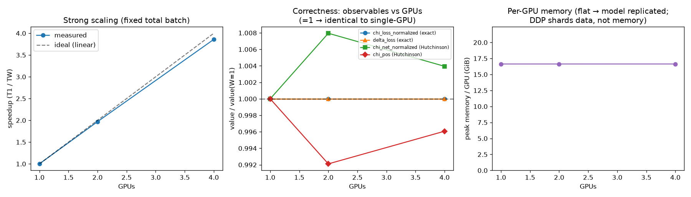

# Multi-GPU DDP scaling — vatis

Model: 1,414,647,808 params. Generated from `/data/horse/ws/koni010i-dpo_sft_transition/vatis/examples/benchmark/ddp_scaling/out`.
vatis DDP replicates the model on every rank and shards the eval batch along its first dim (data-parallel over eval data, not model size).

## Correctness (multi-GPU vs single-GPU)

- `strong` W=2 vs W=1: **PASS** (exact: chi_loss_normalized=0.0e+00, delta_loss=3.0e-11 ≤ 1e-03; noise: chi_net_normalized=8.0e-03, chi_pos=7.9e-03 ≤ 10%)
- `strong` W=4 vs W=1: **PASS** (exact: chi_loss_normalized=0.0e+00, delta_loss=3.6e-11 ≤ 1e-03; noise: chi_net_normalized=3.9e-03, chi_pos=3.9e-03 ≤ 10%)
- `weak`: total batch varies across W ([8, 16, 32]) — not a same-batch comparison (weak-scaling family); correctness check skipped.

**Overall: ALL PASS**

## Strong scaling (fixed total batch)

Total batch B=32, S=128, n_h=32, method=hutchinson, dtype=bf16.

| GPUs | B/GPU | wall_s | speedup | efficiency |
|---|---|---|---|---|
| 1 | 32 | 96.66 | 1.00× | 100% |
| 2 | 16 | 49.07 | 1.97× | 98% |
| 4 | 8 | 25.05 | 3.86× | 96% |

## Weak scaling (fixed batch-per-GPU — the 'too much data for one GPU' case)

Batch-per-GPU fixed at 8, S=128, n_h=32, method=hutchinson.
Ideal: wallclock flat while total data + throughput grow ~linearly.

| GPUs | total B | wall_s | throughput (seq/s) |
|---|---|---|---|
| 1 | 8 | 24.55 | 0.33 |
| 2 | 16 | 24.52 | 0.65 |
| 4 | 32 | 24.83 | 1.29 |

