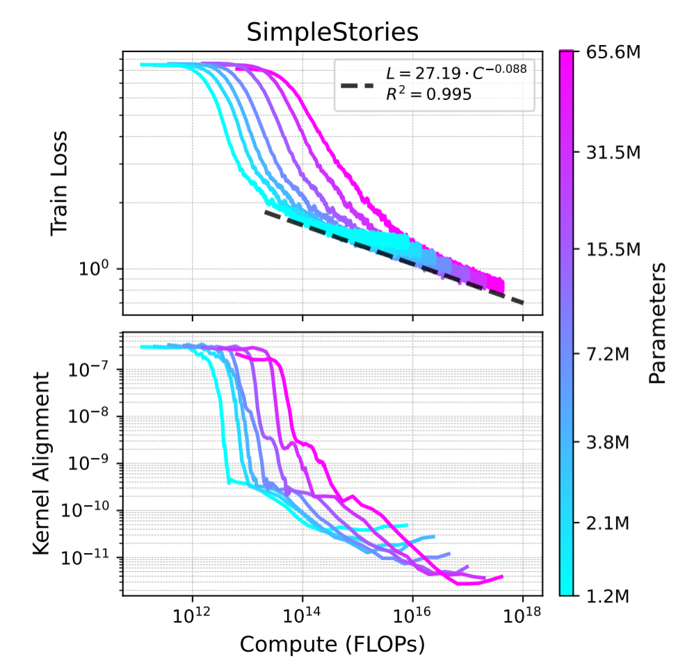

# DPO as a spectral filter

## The claim

Standard LLM alignment pipelines run SFT first, then DPO. The transition
between them is chosen by heuristic — run SFT until the loss plateaus, then
switch. This work proposes:

1. A **diagnostic** for when a model is ready to switch from SFT to DPO,
   computable from a cheap gradient dot product.
2. A **theoretical test** of the claim that DPO operates in the spectral tail
   of supervised learning — a claim that, if true, places preference
   optimization in the learning-theoretic picture of neural network training.

These are two logically independent claims. The diagnostic can work even if
the spectral theory is wrong. The theory can be confirmed independently of
the diagnostic's utility. Both use the same measurements.

## Background: what we know from pre-training

A neural network does not learn all features equally easily. At any point
during training, some directions in the model's output space respond strongly
to weight updates, others barely at all. The **spectrum** ranks these
directions by how strongly they respond.

Intuitively: large eigenvalues correspond to dominant, shared features —
directions that many data samples pull the model toward (grammar, common
patterns, coarse semantics). Small eigenvalues correspond to sparse
directions — features only a few samples push on (subtle distinctions,
fine-grained quality). The top of the spectrum is the **bulk**; the tail is,
well, the tail.

Empirically, gradient descent resolves this spectrum from bulk to tail.
Large-eigenvalue directions are learned first; small-eigenvalue directions
are learned last.

The figure shows kernel alignment (a scalar measuring where the loss gradient
sits in the spectrum — high = bulk, low = tail) dropping systematically during
pre-training on SimpleStories, across model scales from 7M to 66M parameters.
The loss follows a clean power law; the kernel alignment reveals the spectral
story underneath: learning progresses from bulk to tail.

## Hypothesis: SFT extends this, DPO operates on the tail

SFT is a continuation of pre-training with specific high-quality data. The same
bulk-to-tail dynamics should apply: early SFT resolves coarse features shared
by all in-distribution completions; late SFT resolves subtler features
distinguishing good completions from bad. Once the bulk is resolved, the
remaining signals are weak — small eigenvalues, small gradients, diminishing
returns from continued SFT.

Now consider DPO. Its gradient is the *difference* of two score functions:

$$\nabla_\theta \mathcal{L}_{\mathrm{DPO}} \propto \nabla_\theta \log \pi_\theta(y_w \mid x) - \nabla_\theta \log \pi_\theta(y_l \mid x)$$

When $y_w$ and $y_l$ are completions to the same prompt, their score
functions share most of their structure (same prompt, similar syntax, similar
surface patterns). The subtraction cancels the shared part. What survives is
the component where they differ. 
Since DPO improves on SFT, it is targeting the parts of the signals that SFT hasn't resolved yet — likely living in the tail of the spectrum. 

**This suggests a natural reading of why we switch from SFT to DPO.** SFT
eventually hits a regime where only weak tail signals remain. If DPO then
starts making progress again, it must be because its contrastive structure
highlights exactly those tail modes — features the bulk-focused SFT gradient
can't reach.

## Two goals

We want to do two things, and they require the same measurements but have
different standards of proof:

1. **Test the hypothesis.** Does DPO's loss gradient live in the spectral
   tail relative to SFT's? This is a claim about mechanism.
2. **Provide a readiness diagnostic.** Can we tell, from the current model
   state, whether SFT has resolved enough structure for DPO to take over?
   This is a practical tool.

## Two diagnostics

Consider a held-out preference pair $(y_w, y_l)$ for prompt $x$. Evaluate at
each SFT checkpoint:

**(a) Spectral-position ratio:**

$$R_{\mathrm{spec}} = \frac{\chi_{\mathrm{pos}}(\mathcal{L}_{\mathrm{DPO}}, \mathcal{L}_{\mathrm{DPO}})}{\chi_{\mathrm{pos}}(\mathcal{L}_{\mathrm{CE}}, \mathcal{L}_{\mathrm{CE}})}$$

where $\chi_{\mathrm{pos}}(\mathcal{L}, \mathcal{L})$ is a spectral position
score (see [derivations.md](derivations.md)). It measures the (normalized) eigenvalue of the spectrum that the model currently learns. 
It lives in $[0, 1]$ — close
to 1 when the loss gradient aligns with bulk eigenmodes, close to 0 when it
aligns with the tail.

If the hypthesis is correct, data that sits in the tail for CE (small $\chi_{\mathrm{pos}}$) sit in the bulk for DPO (large $\chi_{\mathrm{pos}}$), so $R_{\mathrm{spec}}$ should increase above 1 during SFT. This picture means that changing to the DPO objective effectively applies a spectral filter that cancels the bulk and isolates the tail. We expect this behavior to be more pronounced the more nuanced the preference pairs are.

**(b) Directional alignment:**

$$R_{\mathrm{dir}} 
= \frac{\chi_{\mathrm{pos}}(\mathcal{L}_{\mathrm{DPO}}, \mathcal{L}_{\mathrm{CE}})}{\sqrt{\chi_{\mathrm{pos}}(\mathcal{L}_{\mathrm{DPO}}, \mathcal{L}_{\mathrm{DPO}}) \cdot \chi_{\mathrm{pos}}(\mathcal{L}_{\mathrm{CE}}, \mathcal{L}_{\mathrm{CE}})}}
= \frac{\langle \nabla_\theta \mathcal{L}_{\mathrm{DPO}},\; \nabla_\theta \mathcal{L}_{\mathrm{CE}} \rangle}{\lVert \nabla_\theta \mathcal{L}_{\mathrm{DPO}} \rVert \;\lVert \nabla_\theta \mathcal{L}_{\mathrm{CE}} \rVert}$$

Bounded in $[-1, 1]$. Sign interpretation:

- $R_{\mathrm{dir}} > 0$: an SFT step also reduces the DPO loss. The two
  objectives are aligned.
- $R_{\mathrm{dir}} \approx 0$: orthogonal. SFT neither helps nor hurts DPO.
- $R_{\mathrm{dir}} < 0$: the objectives are in conflict.

This is the **readiness claim** — a test of whether an SFT step is
operationally useful for DPO, regardless of why. For maximum readiness, we want to maximize $R_{\mathrm{dir}}$ — the more SFT pushes toward the DPO tail, the better.

**Why $R_{\mathrm{dir}}$ is surprisingly cheap.** $R_{\mathrm{dir}}$ can be
derived from the same spectral decomposition used for $R_{\mathrm{spec}}$, but
it reduces to a plain parameter-space cosine. Computing it requires only two
backward passes (one for each loss) and a dot product — **no Hutchinson trace
estimation, no Jacobian machinery**. This matters in practice: you can
evaluate $R_{\mathrm{dir}}$ at every SFT checkpoint at negligible cost.
$R_{\mathrm{spec}}$ requires Hutchinson trace estimation through vatis, so
it's more expensive but still tractable on held-out evaluation data.

## Four possible outcomes

The two diagnostics can each pass or fail independently:

| $R_{\mathrm{spec}} > 1$ | $R_{\mathrm{dir}}$ stable positive | conclusion |
|---|---|---|
| ✓ | ✓ | hypothesis supported, diagnostic works |
| ✗ | ✓ | hypothesis wrong — but the practical diagnostic still works via a different mechanism |
| ✓ | ✗ | DPO is spectrally separated from SFT but SFT doesn't help — interesting anomaly |
| ✗ | ✗ | the whole picture doesn't apply |

The practical claim is **robust**: it survives even if the theoretical story
is wrong. The theoretical claim is **independently testable**: we can
falsify or support it regardless of whether the diagnostic has practical
value. This is a stronger position than a single combined measurement.

## Detection strategy

Evaluate both diagnostics on a held-out set of preference pairs at regular
SFT checkpoints. Per-pair measurements are noisy; aggregation is what turns
them into high-confidence detection:

- Track the **median $R_{\mathrm{spec}}$** across the held-out set per
  checkpoint. The transition is a rise above a threshold (say 5) — CE's
  gradient has slid into its own tail while DPO's gradient sits in the bulk
  of its own kernel.
- Track the **fraction of pairs with $R_{\mathrm{dir}} > 0$**. The transition
  is when this fraction exceeds (say) 80%.

The readiness point is when **both** conditions are met:

- $R_{\mathrm{spec}}$ large → CE has exhausted its bulk (SFT signal is
  decaying) while DPO has untapped bulk signal in its own kernel
- $R_{\mathrm{dir}}$ positive → SFT is currently pushing in a direction that
  also reduces DPO loss

Either alone has a failure mode. $R_{\mathrm{spec}}$ large but
$R_{\mathrm{dir}} \approx 0$: the two objectives are spectrally separated but
orthogonal — switching to DPO may work but further SFT won't help build
toward it. $R_{\mathrm{spec}} \approx 1$ but $R_{\mathrm{dir}} > 0$: SFT and
DPO overlap, both in the bulk of their respective kernels — more SFT is
still useful, DPO hasn't specialized yet. Only the conjunction says "the
objectives have spectrally separated, DPO has fresh signal to learn, and
SFT is currently pushing toward it."

## Relation to the spectral\_tail experiment

A previous experiment in this repo asked whether $\chi_{\mathrm{pos}}$ can
detect when a model resolves shared semantic structure between Python and C++
implementations of the same algorithms. The signal was ambiguous.

This experiment is the same question in a setting where the shared structure
is operationally defined (the preference dataset tells us which features
matter) and the spectral arrival should be more pronounced (DPO explicitly
targets the distinguishing features, whereas pre-training resolves them
incidentally).

If $R_{\mathrm{spec}}$ and $R_{\mathrm{dir}}$ show clear transitions during
SFT→DPO, it retroactively validates the spectral\_tail approach and suggests
the earlier experiment was limited by probe design, not by the method itself.

## Open questions

- **Threshold choice.** What values of $\tau_{\mathrm{spec}}$ and
  $\tau_{\mathrm{dir}}$ mark the transition? Do they vary by model scale, by
  preference-dataset quality, by DPO hyperparameters?
- **When does the filter fail?** The spectral cancellation in DPO relies on
  $y_w$ and $y_l$ sharing bulk representations (structurally similar
  completions). When pairs are very different (a 500-token helpful response
  vs a 20-token refusal), the bulk doesn't cancel cleanly. The hypothesis
  predicts degraded $R_{\mathrm{spec}}$ for such pairs — does it hold?
- **Linearization accuracy.** The LNA (linear network approximation)
  underlies the decomposition. DPO operates with small learning rates on a
  pre-trained model, which is favorable for linearization, but the spectral
  tail has small eigenvalues where higher-order terms may matter.
- **Disentangling cause and effect.** Can we show that DPO *resolves* the
  tail modes it targets, rather than just operating there? This would require
  tracking $R_{\mathrm{spec}}$ through DPO training itself.
